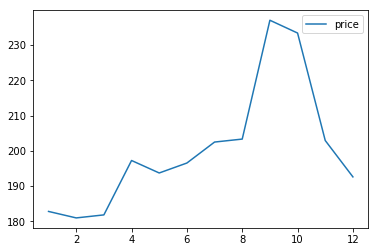
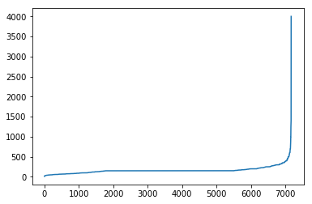
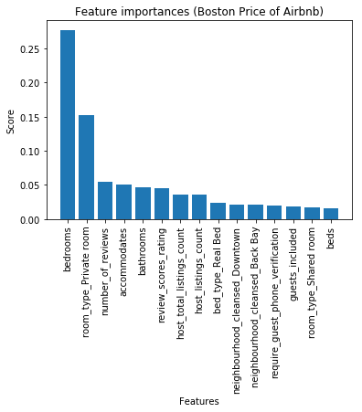

```python
import numpy as np
import pandas as pd
import matplotlib.pyplot as plt
from langdetect import detect

from sklearn.ensemble import RandomForestRegressor
from sklearn.model_selection import train_test_split
from sklearn.metrics import r2_score, mean_squared_error

%matplotlib inline
```

### Business and Data Understanding

As talk on Airbnb kaggle data website, the following Airbnb activity is included in this Boston dataset: 
* Calendar, including listing id and the price and availability for that day
* Listings, including full descriptions and average review score 
* Reviews, including unique id for each reviewer and detailed comments 


Let us take a look on these three csv files.

#### Calendar


```python
cdf = pd.read_csv('./boston-airbnb/calendar.csv')
cdf.head()
```


<div>
<style scoped>
    .dataframe tbody tr th:only-of-type {
        vertical-align: middle;
    }

    .dataframe tbody tr th {
        vertical-align: top;
    }

    .dataframe thead th {
        text-align: right;
    }
</style>
<table border="1" class="dataframe">
  <thead>
    <tr style="text-align: right;">
      <th></th>
      <th>listing_id</th>
      <th>date</th>
      <th>available</th>
      <th>price</th>
    </tr>
  </thead>
  <tbody>
    <tr>
      <th>0</th>
      <td>12147973</td>
      <td>2017-09-05</td>
      <td>f</td>
      <td>NaN</td>
    </tr>
    <tr>
      <th>1</th>
      <td>12147973</td>
      <td>2017-09-04</td>
      <td>f</td>
      <td>NaN</td>
    </tr>
    <tr>
      <th>2</th>
      <td>12147973</td>
      <td>2017-09-03</td>
      <td>f</td>
      <td>NaN</td>
    </tr>
    <tr>
      <th>3</th>
      <td>12147973</td>
      <td>2017-09-02</td>
      <td>f</td>
      <td>NaN</td>
    </tr>
    <tr>
      <th>4</th>
      <td>12147973</td>
      <td>2017-09-01</td>
      <td>f</td>
      <td>NaN</td>
    </tr>
  </tbody>
</table>
</div>


It shows that the hosts are not avaible everyday and price may be changed at the busiest seasons. 

* What is the most expensive season in Boston? 
* Which hosts are the most favorite？

#### Listings


```python
ldf = pd.read_csv('./boston-airbnb/listings.csv')
ldf.head()
```


<div>
<style scoped>
    .dataframe tbody tr th:only-of-type {
        vertical-align: middle;
    }

    .dataframe tbody tr th {
        vertical-align: top;
    }

    .dataframe thead th {
        text-align: right;
    }
</style>
<table border="1" class="dataframe">
  <thead>
    <tr style="text-align: right;">
      <th></th>
      <th>id</th>
      <th>listing_url</th>
      <th>scrape_id</th>
      <th>last_scraped</th>
      <th>name</th>
      <th>summary</th>
      <th>space</th>
      <th>description</th>
      <th>experiences_offered</th>
      <th>neighborhood_overview</th>
      <th>...</th>
      <th>review_scores_value</th>
      <th>requires_license</th>
      <th>license</th>
      <th>jurisdiction_names</th>
      <th>instant_bookable</th>
      <th>cancellation_policy</th>
      <th>require_guest_profile_picture</th>
      <th>require_guest_phone_verification</th>
      <th>calculated_host_listings_count</th>
      <th>reviews_per_month</th>
    </tr>
  </thead>
  <tbody>
    <tr>
      <th>0</th>
      <td>12147973</td>
      <td>https://www.airbnb.com/rooms/12147973</td>
      <td>20160906204935</td>
      <td>2016-09-07</td>
      <td>Sunny Bungalow in the City</td>
      <td>Cozy, sunny, family home.  Master bedroom high...</td>
      <td>The house has an open and cozy feel at the sam...</td>
      <td>Cozy, sunny, family home.  Master bedroom high...</td>
      <td>none</td>
      <td>Roslindale is quiet, convenient and friendly. ...</td>
      <td>...</td>
      <td>NaN</td>
      <td>f</td>
      <td>NaN</td>
      <td>NaN</td>
      <td>f</td>
      <td>moderate</td>
      <td>f</td>
      <td>f</td>
      <td>1</td>
      <td>NaN</td>
    </tr>
    <tr>
      <th>1</th>
      <td>3075044</td>
      <td>https://www.airbnb.com/rooms/3075044</td>
      <td>20160906204935</td>
      <td>2016-09-07</td>
      <td>Charming room in pet friendly apt</td>
      <td>Charming and quiet room in a second floor 1910...</td>
      <td>Small but cozy and quite room with a full size...</td>
      <td>Charming and quiet room in a second floor 1910...</td>
      <td>none</td>
      <td>The room is in Roslindale, a diverse and prima...</td>
      <td>...</td>
      <td>9.0</td>
      <td>f</td>
      <td>NaN</td>
      <td>NaN</td>
      <td>t</td>
      <td>moderate</td>
      <td>f</td>
      <td>f</td>
      <td>1</td>
      <td>1.30</td>
    </tr>
    <tr>
      <th>2</th>
      <td>6976</td>
      <td>https://www.airbnb.com/rooms/6976</td>
      <td>20160906204935</td>
      <td>2016-09-07</td>
      <td>Mexican Folk Art Haven in Boston</td>
      <td>Come stay with a friendly, middle-aged guy in ...</td>
      <td>Come stay with a friendly, middle-aged guy in ...</td>
      <td>Come stay with a friendly, middle-aged guy in ...</td>
      <td>none</td>
      <td>The LOCATION: Roslindale is a safe and diverse...</td>
      <td>...</td>
      <td>10.0</td>
      <td>f</td>
      <td>NaN</td>
      <td>NaN</td>
      <td>f</td>
      <td>moderate</td>
      <td>t</td>
      <td>f</td>
      <td>1</td>
      <td>0.47</td>
    </tr>
    <tr>
      <th>3</th>
      <td>1436513</td>
      <td>https://www.airbnb.com/rooms/1436513</td>
      <td>20160906204935</td>
      <td>2016-09-07</td>
      <td>Spacious Sunny Bedroom Suite in Historic Home</td>
      <td>Come experience the comforts of home away from...</td>
      <td>Most places you find in Boston are small howev...</td>
      <td>Come experience the comforts of home away from...</td>
      <td>none</td>
      <td>Roslindale is a lovely little neighborhood loc...</td>
      <td>...</td>
      <td>10.0</td>
      <td>f</td>
      <td>NaN</td>
      <td>NaN</td>
      <td>f</td>
      <td>moderate</td>
      <td>f</td>
      <td>f</td>
      <td>1</td>
      <td>1.00</td>
    </tr>
    <tr>
      <th>4</th>
      <td>7651065</td>
      <td>https://www.airbnb.com/rooms/7651065</td>
      <td>20160906204935</td>
      <td>2016-09-07</td>
      <td>Come Home to Boston</td>
      <td>My comfy, clean and relaxing home is one block...</td>
      <td>Clean, attractive, private room, one block fro...</td>
      <td>My comfy, clean and relaxing home is one block...</td>
      <td>none</td>
      <td>I love the proximity to downtown, the neighbor...</td>
      <td>...</td>
      <td>10.0</td>
      <td>f</td>
      <td>NaN</td>
      <td>NaN</td>
      <td>f</td>
      <td>flexible</td>
      <td>f</td>
      <td>f</td>
      <td>1</td>
      <td>2.25</td>
    </tr>
  </tbody>
</table>
<p>5 rows × 95 columns</p>
</div>


Summary information on listing in Boston.It contains location, host information, cleaning and guest fees, amenities and so on.
We may find some import factors on price.

* What are the top factors strong relation to price?
* How to predict price？


#### Reviews


```python
rdf = pd.read_csv('./boston-airbnb/reviews.csv')
rdf.head()
```


<div>
<style scoped>
    .dataframe tbody tr th:only-of-type {
        vertical-align: middle;
    }

    .dataframe tbody tr th {
        vertical-align: top;
    }

    .dataframe thead th {
        text-align: right;
    }
</style>
<table border="1" class="dataframe">
  <thead>
    <tr style="text-align: right;">
      <th></th>
      <th>listing_id</th>
      <th>id</th>
      <th>date</th>
      <th>reviewer_id</th>
      <th>reviewer_name</th>
      <th>comments</th>
    </tr>
  </thead>
  <tbody>
    <tr>
      <th>0</th>
      <td>1178162</td>
      <td>4724140</td>
      <td>2013-05-21</td>
      <td>4298113</td>
      <td>Olivier</td>
      <td>My stay at islam's place was really cool! Good...</td>
    </tr>
    <tr>
      <th>1</th>
      <td>1178162</td>
      <td>4869189</td>
      <td>2013-05-29</td>
      <td>6452964</td>
      <td>Charlotte</td>
      <td>Great location for both airport and city - gre...</td>
    </tr>
    <tr>
      <th>2</th>
      <td>1178162</td>
      <td>5003196</td>
      <td>2013-06-06</td>
      <td>6449554</td>
      <td>Sebastian</td>
      <td>We really enjoyed our stay at Islams house. Fr...</td>
    </tr>
    <tr>
      <th>3</th>
      <td>1178162</td>
      <td>5150351</td>
      <td>2013-06-15</td>
      <td>2215611</td>
      <td>Marine</td>
      <td>The room was nice and clean and so were the co...</td>
    </tr>
    <tr>
      <th>4</th>
      <td>1178162</td>
      <td>5171140</td>
      <td>2013-06-16</td>
      <td>6848427</td>
      <td>Andrew</td>
      <td>Great location. Just 5 mins walk from the Airp...</td>
    </tr>
  </tbody>
</table>
</div>


We can find many interesting opinions,sush as 

* What are the most attractive facilities? It is big bed, large room or location?
* What will lead to bad impression？

### Data preparing

#### Clean Calendar


```python
def clean_calendar(df):
    # Filter unavailable data.
    df = df[df['available'] == 't'].copy()
    
    # Remove "$," in price and convert to float
    df['price'] = df['price'].str.replace(',', '')
    df['price'] = df['price'].str.replace('$', '')
    df['price'] = df['price'].astype(float)
    
    # Set year/month
    df['year'] = df['date'].str[0:4]
    df['month'] = df['date'].str[5:7]
    
    return df
    
```


```python
# clean data
cdf_clean = clean_calendar(cdf)
```


```python
# get average price every month and plot
cdf_avg = cdf_clean.groupby(['month'], as_index=False)['price'].mean()

cdf_avg.index = cdf_avg.index+1
cdf_avg.plot()
```


    <matplotlib.axes._subplots.AxesSubplot at 0x12b114978>





* So we can see the most expensive season is from August to November，especial September and October. 
* You can get a lowest price if you go to Boston at February.


```python
# The most expensive listing_id
cdf_clean.loc[cdf_clean['price'].idxmax()]
```


    listing_id        447826
    date          2016-10-26
    available              t
    price               7163
    year                2016
    month                 10
    Name: 110179, dtype: object


* The most expensive listing_id is 447826.Go to Boston and experience one night.


```python
ldf[ldf.id==447826][['id','listing_url','scrape_id','host_url','name',
                     'bedrooms','accommodates','bathrooms','amenities']].T
```


<div>
<style scoped>
    .dataframe tbody tr th:only-of-type {
        vertical-align: middle;
    }

    .dataframe tbody tr th {
        vertical-align: top;
    }

    .dataframe thead th {
        text-align: right;
    }
</style>
<table border="1" class="dataframe">
  <thead>
    <tr style="text-align: right;">
      <th></th>
      <th>301</th>
    </tr>
  </thead>
  <tbody>
    <tr>
      <th>id</th>
      <td>447826</td>
    </tr>
    <tr>
      <th>listing_url</th>
      <td>https://www.airbnb.com/rooms/447826</td>
    </tr>
    <tr>
      <th>scrape_id</th>
      <td>20160906204935</td>
    </tr>
    <tr>
      <th>host_url</th>
      <td>https://www.airbnb.com/users/show/2053557</td>
    </tr>
    <tr>
      <th>name</th>
      <td>Sweet Little House in JP, Boston</td>
    </tr>
    <tr>
      <th>bedrooms</th>
      <td>1</td>
    </tr>
    <tr>
      <th>accommodates</th>
      <td>2</td>
    </tr>
    <tr>
      <th>bathrooms</th>
      <td>1</td>
    </tr>
    <tr>
      <th>amenities</th>
      <td>{TV,"Cable TV",Internet,"Wireless Internet",Ki...</td>
    </tr>
  </tbody>
</table>
</div>


#### Clean Listings


```python
def trans_amenities(df):
    # amenities is json object,can't trans as normal dummy variable
    df['amenities'] = df['amenities'].map(lambda amns: "|".join(
        [amn.replace("}", "").replace("{", "").replace('"', "") for amn in amns.split(",")]))


    amenities = np.unique(np.concatenate(df['amenities'].map(lambda amns: amns.split("|"))))[1:]
    amenity_arr = np.array([df['amenities'].map(lambda amns: amn in amns) for amn in amenities])
    return pd.DataFrame(data=amenity_arr.T, columns=amenities)
    

def create_dummy_df(df):
    # get string columns
    cat_cols = df.select_dtypes(include=['object']).columns
    # set dummy columns
    for col in  cat_cols:
        try:
            # json object
            if col == 'amenities':
                df = pd.concat([df.drop(col, axis=1),trans_amenities(df)])
            # boolean str(f/t)
            elif col in ['host_is_superhost', 'host_identity_verified', 
                            'host_has_profile_pic','is_location_exact', 
                            'requires_license', 'instant_bookable',
                            'require_guest_profile_picture','require_guest_phone_verification']:
                df[col] = df[col].map(lambda s: 0 if s == "f" else 1)
            # category
            else:
                # for each cat add dummy var, drop original column
                df = pd.concat([df.drop(col, axis=1), 
                            pd.get_dummies(df[col], prefix=col, prefix_sep='_', 
                                           drop_first=True, dummy_na=False)], axis=1)
        except:
            continue
    return df

def clean_listings(df):   
    # Drop the rows with missing price
    df = df.dropna(subset=['price'], axis=0)
    
    # Drop the nan columns
    df = df.dropna(how='all', axis=1)

    # Remove "$," in price and convert to float
    df['price'] = df['price'].str.replace(',', '')
    df['price'] = df['price'].str.replace('$', '')
    df['price'] = df['price'].astype(float)
    
    #Dummy categorical variables
    df = create_dummy_df(df)

    # Median function
    fill_mean = lambda col: col.fillna(col.median())
    # Fill the mean
    df = df.apply(fill_mean, axis=0)
    
    return df
    
```


```python
# Only use quant/cate variables and drop any rows with missing values
num_vars = ldf[['price','host_listings_count', 'host_total_listings_count', 'accommodates', 
                     'bathrooms', 'bedrooms', 'beds', 'guests_included', 'number_of_reviews',
                     'review_scores_rating','amenities','host_is_superhost', 'host_identity_verified',
                     'host_has_profile_pic','is_location_exact', 'requires_license', 'instant_bookable',
                     'require_guest_profile_picture', 'require_guest_phone_verification',
                     'neighbourhood_cleansed', 'property_type', 'room_type', 'bed_type']]

ldf_clean = clean_listings(num_vars)
```

Let us calculate the mean/std of 'Price'.

* Assuming that prices obey normal distribution
* The price should be between mean-2*std~mean+2*std


```python
ldf_clean['price'].describe()
```


    count    7170.000000
    mean      161.962901
    std       105.558926
    min        10.000000
    25%       150.000000
    50%       150.000000
    75%       150.000000
    max      4000.000000
    Name: price, dtype: float64


```python
# plot price
ldf_clean['price'].sort_values().reset_index(drop=True).plot()
```


    <matplotlib.axes._subplots.AxesSubplot at 0x133351668>





```python
# fitler price
threshold = 500 
ldf_clean = ldf_clean[ldf_clean.price<=threshold]
```

#### Clean Reviews

Review the reviews.csv file,you will find there are different languages.We just need to keep the english comment.<br>
We need a lib 'langdetect'.

```
pip install langdetect
```


```python
rdf.head()
```


<div>
<style scoped>
    .dataframe tbody tr th:only-of-type {
        vertical-align: middle;
    }

    .dataframe tbody tr th {
        vertical-align: top;
    }

    .dataframe thead th {
        text-align: right;
    }
</style>
<table border="1" class="dataframe">
  <thead>
    <tr style="text-align: right;">
      <th></th>
      <th>listing_id</th>
      <th>id</th>
      <th>date</th>
      <th>reviewer_id</th>
      <th>reviewer_name</th>
      <th>comments</th>
    </tr>
  </thead>
  <tbody>
    <tr>
      <th>0</th>
      <td>1178162</td>
      <td>4724140</td>
      <td>2013-05-21</td>
      <td>4298113</td>
      <td>Olivier</td>
      <td>My stay at islam's place was really cool! Good...</td>
    </tr>
    <tr>
      <th>1</th>
      <td>1178162</td>
      <td>4869189</td>
      <td>2013-05-29</td>
      <td>6452964</td>
      <td>Charlotte</td>
      <td>Great location for both airport and city - gre...</td>
    </tr>
    <tr>
      <th>2</th>
      <td>1178162</td>
      <td>5003196</td>
      <td>2013-06-06</td>
      <td>6449554</td>
      <td>Sebastian</td>
      <td>We really enjoyed our stay at Islams house. Fr...</td>
    </tr>
    <tr>
      <th>3</th>
      <td>1178162</td>
      <td>5150351</td>
      <td>2013-06-15</td>
      <td>2215611</td>
      <td>Marine</td>
      <td>The room was nice and clean and so were the co...</td>
    </tr>
    <tr>
      <th>4</th>
      <td>1178162</td>
      <td>5171140</td>
      <td>2013-06-16</td>
      <td>6848427</td>
      <td>Andrew</td>
      <td>Great location. Just 5 mins walk from the Airp...</td>
    </tr>
  </tbody>
</table>
</div>


```python
def detect_safe(c):
    try:
        return detect(c) == 'en'
    except:
        pass
    return False

def clean_reviews(df):
    # check comments language
    df['is_en'] = df['comments'].apply(lambda c:detect_safe(c))
    return df[df.is_en]
```


```python
rdf_clean = clean_reviews(rdf)
```


```python
rdf_clean.head()
```


<div>
<style scoped>
    .dataframe tbody tr th:only-of-type {
        vertical-align: middle;
    }

    .dataframe tbody tr th {
        vertical-align: top;
    }

    .dataframe thead th {
        text-align: right;
    }
</style>
<table border="1" class="dataframe">
  <thead>
    <tr style="text-align: right;">
      <th></th>
      <th>listing_id</th>
      <th>id</th>
      <th>date</th>
      <th>reviewer_id</th>
      <th>reviewer_name</th>
      <th>comments</th>
      <th>is_en</th>
    </tr>
  </thead>
  <tbody>
    <tr>
      <th>0</th>
      <td>1178162</td>
      <td>4724140</td>
      <td>2013-05-21</td>
      <td>4298113</td>
      <td>Olivier</td>
      <td>My stay at islam's place was really cool! Good...</td>
      <td>True</td>
    </tr>
    <tr>
      <th>1</th>
      <td>1178162</td>
      <td>4869189</td>
      <td>2013-05-29</td>
      <td>6452964</td>
      <td>Charlotte</td>
      <td>Great location for both airport and city - gre...</td>
      <td>True</td>
    </tr>
    <tr>
      <th>2</th>
      <td>1178162</td>
      <td>5003196</td>
      <td>2013-06-06</td>
      <td>6449554</td>
      <td>Sebastian</td>
      <td>We really enjoyed our stay at Islams house. Fr...</td>
      <td>True</td>
    </tr>
    <tr>
      <th>3</th>
      <td>1178162</td>
      <td>5150351</td>
      <td>2013-06-15</td>
      <td>2215611</td>
      <td>Marine</td>
      <td>The room was nice and clean and so were the co...</td>
      <td>True</td>
    </tr>
    <tr>
      <th>4</th>
      <td>1178162</td>
      <td>5171140</td>
      <td>2013-06-16</td>
      <td>6848427</td>
      <td>Andrew</td>
      <td>Great location. Just 5 mins walk from the Airp...</td>
      <td>True</td>
    </tr>
  </tbody>
</table>
</div>


### Modeling and  evaluation

Let's try to predict the price based on the columns in the listing we selected.


```python
#Split into explanatory and response variables
X = ldf_clean.drop(['price'], axis=1)
y = ldf_clean['price']

#Split into train and test
RAND_STATE = 42
X_train, X_test, y_train, y_test = train_test_split(X, y, test_size = .30, random_state=RAND_STATE) 

# train a RandomForest model
forest = RandomForestRegressor(n_estimators=100, 
                               criterion='mse', 
                               random_state=RAND_STATE, 
                               n_jobs=-1)
forest.fit(X_train, y_train) #Fit
        
#Predict and score the model
y_test_preds = forest.predict(X_test) 

#Rsquared and y_test
rsquared_score = r2_score(y_test, y_test_preds)
length_y_test = len(y_test)

"The r-squared score for your model was {} on {} values.".format(rsquared_score, length_y_test)
```


    'The r-squared score for your model was 0.6256165829115665 on 2132 values.'


* What are the top factors strong relation to price?


```python
#get feature importances from the model
headers = ["name", "score"]
values = sorted(zip(X_train.columns, forest.feature_importances_), key=lambda x: x[1] * -1)
forest_feature_importances = pd.DataFrame(values, columns = headers)
forest_feature_importances = forest_feature_importances.sort_values(by = ['score'], ascending = False)

features = forest_feature_importances['name'][:15]
y_pos = np.arange(len(features))
scores = forest_feature_importances['score'][:15]

#plot feature importances
plt.bar(y_pos, scores, align='center')
plt.xticks(y_pos, features, rotation='vertical')
plt.ylabel('Score')
plt.xlabel('Features')
plt.title('Feature importances (Boston Price of Airbnb)')
```


    <matplotlib.text.Text at 0x138fe3128>





Top 6 factors strong relation to price:
* bedrooms
* room type : Private room
* number of reviews
* accommodates
* bathrooms
* review scores rating

### Deployment

Mostly,the model will be deplyed on product environment based on a RPC server or http server.<br>
You can deploy the model with Tornado(python web framework).


```python

```
